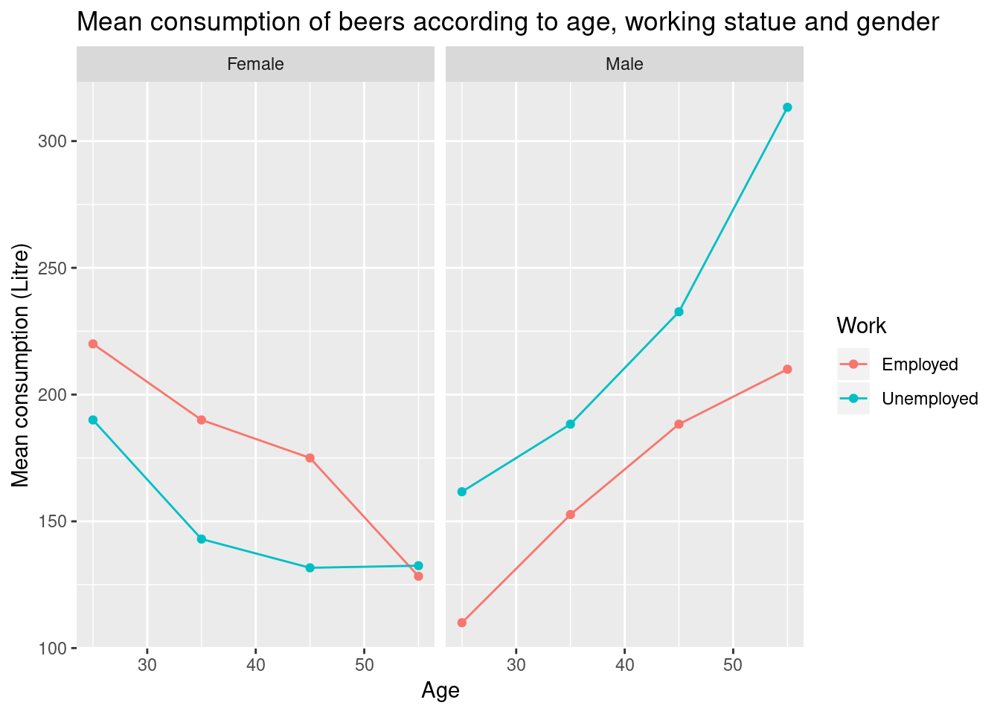

# Manipulating and analyzing data with dplyr  {#sec-dplyr}


**Learning Objectives**

- Describe the purpose of the **`dplyr`** and **`tidyr`** packages.

- Select certain columns in a data frame with the **`dplyr`** function
  `select`.

- Select certain rows in a data frame according to filtering
  conditions with the **`dplyr`** function `filter` .

- Link the output of one **`dplyr`** function to the input of another
  function with the 'pipe' operator `%>%` or `|>`.

- Add new columns to a data frame that are functions of existing
  columns with `mutate`.

- Use the split-apply-combine concept for data analysis.

- Use `summarize`, `group_by`, and `count` to split a data frame into
  groups of observations, apply summary statistics for each group, and
  then combine the results.

- Describe the concept of a wide and a long table format and for which
  purpose those formats are useful.

- Reshape a data frame from long to wide format and back with the
  `pivot_wider()` and `pivot_longer()` commands from the
  **`tidyr`** package.


## Data Manipulation using **`dplyr`** and **`tidyr`**

Bracket subsetting is handy, but it can be cumbersome and difficult to
read, especially for complicated operations. Enter
**`dplyr`**. **`dplyr`** is a package for making tabular data
manipulation easier. It pairs nicely with **`tidyr`** which enables
you to swiftly convert between different data formats for plotting and
analysis.

Packages in R are basically sets of additional functions that let you
do more stuff. The functions we've been using so far, like `str()` or
`data.frame()`, come built into R; packages give you access to more of
them. Before you use a package for the first time you need to install
it on your machine, and then you should import it in every subsequent
R session when you need it. You should already have installed the
**`tidyverse`** package. This is an "umbrella-package" that installs
several packages useful for data analysis which work together well
such as **`tidyr`**, **`dplyr`**, **`ggplot2`**, **`tibble`**, etc.


The **`tidyverse`** package tries to address 3 common issues that
arise when doing data analysis with some of functions that come with
R:

1. The results from a base R function sometimes depend on the type of data.
2. Using R expressions in a non standard way, which can be confusing for new
   learners.
3. Hidden arguments, having default operations that new learners are not aware
   of.

We have seen in our previous lesson that when building or importing a
data frame, the columns that contain characters (i.e., text) are
coerced (=converted) into the `factor` data type. We had to set
**`stringsAsFactors`** to **`FALSE`** to avoid this hidden argument to
convert our data type.

This time will use the **`tidyverse`** package to read the data and
avoid having to set **`stringsAsFactors`** to **`FALSE`**

To load the package type:


```{r, message = FALSE, purl = FALSE}
## load the tidyverse packages, incl. dplyr
library("tidyverse")
```

The [Data Transformation Cheat
Sheet](https://github.com/rstudio/cheatsheets/raw/main/data-transformation.pdf)
provides an overview of the `dplyr` grammar, offering more details and
functions that we will see in this chapter. The [Tidy Data
Tutor](https://tidydatatutor.com/) is a wonderful tool to do visually
describe what the tidy data operations do.


## What are **`dplyr`** and **`tidyr`**?

The package **`dplyr`** provides easy tools for the most common data manipulation
tasks. It is built to work directly with data frames, with many common tasks
optimized by being written in a compiled language (C++). An additional feature is the
ability to work directly with data stored in an external database. The benefits of
doing this are that the data can be managed natively in a relational database,
queries can be conducted on that database, and only the results of the query are
returned.

This addresses a common problem with R in that all operations are conducted
in-memory and thus the amount of data you can work with is limited by available
memory. The database connections essentially remove that limitation in that you
can connect to a database of many hundreds of GB, conduct queries on it directly, and pull
back into R only what you need for analysis.

The package **`tidyr`** addresses the common problem of wanting to
reshape your data for plotting and use by different R
functions. Sometimes we want data sets where we have one row per
measurement. Sometimes we want a data frame where each measurement
type has its own column, and rows are instead more aggregated groups -
like plots or aquaria. Moving back and forth between these formats is
nontrivial, and **`tidyr`** gives you tools for this and more
sophisticated data manipulation.

To learn more about **`dplyr`** and **`tidyr`** after the workshop,
you may want to check out this [handy data transformation with
**`dplyr`**
cheatsheet](https://github.com/rstudio/cheatsheets/raw/main/data-transformation.pdf)
and this [one about
**`tidyr`**](https://github.com/rstudio/cheatsheets/raw/main/data-import.pdf).

We'll read in our data using the `read_csv()` function, from the
tidyverse package **`readr`**, instead of `read.csv()`.


```{r dplyr_setp, results = 'hide', purl = FALSE}
rna <- read_csv("data/rnaseq.csv")

## inspect the data
str(rna)
## preview the data
# View(rna)
```

Notice that the class of the data is now `tbl_df`

This is referred to as a "tibble". Tibbles tweak some of the behaviors
of the data frame objects we introduced in the previous episode. The
data structure is very similar to a data frame. For our purposes the
only differences are that:

1. In addition to displaying the data type of each column under its name, it
   only prints the first few rows of data and only as many columns as fit on one
   screen.
2. Columns of class `character` are never converted into factors.


We're going to learn some of the most common **`dplyr`** functions:

- `select()`: subset columns
- `filter()`: subset rows on conditions
- `mutate()`: create new columns by using information from other columns
- `group_by()` and `summarize()`: create summary statisitcs on grouped data
- `arrange()`: sort results
- `count()`: count discrete values

## Selecting columns and filtering rows

To select columns of a data frame, use `select()`. The first argument
to this function is the data frame (`rna`), and the subsequent
arguments are the columns to keep.

```{r}
select(rna, gene, sample, tissue, expression)
```

To select all columns *except* certain ones, put a "-" in front of
the variable to exclude it.

```{r}
select(rna, -organism, -strain)
```

This will select all the variables in `rna` except `organism`
and `strain`.

To choose rows based on a specific criteria, use `filter()`:

```{r, purl = FALSE}
filter(rna, sex == "Male")
filter(rna, sex == "Male" & infection == "NonInfected")
```

## Pipes

What if you want to select and filter at the same time? There are
three ways to do this: use intermediate steps, nested functions, or
pipes.

With intermediate steps, you create a temporary data frame and use
that as input to the next function, like this:

```{r, purl = FALSE}
rna2 <- filter(rna, sex == "Male")
rna3 <- select(rna2, gene, sample, tissue, expression)
rna3
```

This is readable, but can clutter up your workspace with lots of
objects that you have to name individually. With multiple steps, that
can be hard to keep track of.

You can also nest functions (i.e. one function inside of another),
like this:

```{r, purl = FALSE}
rna3 <- select(filter(rna, sex == "Male"), gene, sample, tissue, expression)
rna3
```

This is handy, but can be difficult to read if too many functions are
nested, as R evaluates the expression from the inside out (in this
case, filtering, then selecting).

The last option, *pipes*, are a recent addition to R. Pipes let you
take the output of one function and send it directly to the next,
which is useful when you need to do many things to the same dataset.
Pipes in R look like `%>%` (as made available via the **`magrittr`**
package, installed automatically with **`dplyr`**) or `|>` (as
available in base R). If you use RStudio, you can type the pipe with
<kbd>Ctrl</kbd> + <kbd>Shift</kbd> + <kbd>M</kbd> if you have a PC or
<kbd>Cmd</kbd> + <kbd>Shift</kbd> + <kbd>M</kbd> if you have a Mac.

```{r, purl = FALSE}
rna %>%
  filter(sex == "Male") %>%
  select(gene, sample, tissue, expression)
```

Or

```{r, purl = FALSE}
rna  |>
  filter(sex == "Male") |>
  select(gene, sample, tissue, expression)
```

In the above code, we use the pipe to send the `rna` dataset first
through `filter()` to keep rows where `sex` is Male, then through
`select()` to keep only the `gene`, `sample`, `tissue`, and
`expression`columns.  Since `%>%` (and `|>`) takes the object on its
left and passes it as the first argument to the function on its right,
we don't need to explicitly include the data frame as an argument to
the `filter()` and `select()` functions any more.

Some may find it helpful to read the pipe like the word "then". For
instance, in the above example, we took the data frame `rna`, *then*
we `filter`ed for rows with `sex == "Male"`, *then* we `select`ed
columns `gene`, `sample`, `tissue`, and `expression`. The **`dplyr`**
functions by themselves are somewhat simple, but by combining them
into linear workflows with the pipe, we can accomplish more complex
manipulations of data frames.

If we want to create a new object with this smaller version of the
data, we can assign it a new name:

```{r, purl = FALSE}
rna3 <- rna %>%
  filter(sex == "Male") %>%
  select(gene, sample, tissue, expression)

rna3
```


`r msmbstyle::question_begin()`

Using pipes, subset the `rna` data to genes with an expression higher
than 50000 in male mice at time 0, and retain only the columns `gene`,
`sample`, `time`, `expression` and `age`

`r msmbstyle::question_end()`


`r msmbstyle::solution_begin()`
```{r, eval=TRUE, purl=FALSE}
rna %>%
  filter(expression > 50000, sex == "Male", time == 0 ) %>%
  select(gene, sample, time, expression, age)
```
`r msmbstyle::solution_end()`


## Mutate

Frequently you'll want to create new columns based on the values in existing
columns, for example to do unit conversions, or to find the ratio of values in two
columns. For this we'll use `mutate()`.

To create a new column of time in hours:

```{r, purl = FALSE}
rna %>%
  mutate(time_hours = time * 24) %>%
  select(time, time_hours)
```

You can also create a second new column based on the first new column within the same call of `mutate()`:

```{r, purl = FALSE}
rna %>%
  mutate(time_hours = time * 24, time_mn = time_hours * 60) %>%
  select(time, time_hours, time_mn)
```

If this runs off your screen and you just want to see the first few rows, you
can use a pipe to view the `head()` of the data. (Pipes work with non-`dplyr`
functions, too, as long as the **`dplyr`** or `magrittr` package is loaded).

```{r, purl = FALSE}
rna %>%
  mutate(time_hours = time * 24, time_mn = time_hours * 60) %>%
  select(time, time_hours, time_mn) %>%
  head()
```

Let's imagine we are interested in the human homologs of the mouse
genes analysed in this dataset. This information can be found in the
last column of the `rna` tibble, named `hsapiens_homolog_associated_gene_name`.

```{r, purl = FALSE}
rna %>%
  select(gene, hsapiens_homolog_associated_gene_name)
```

Some mouse gene have no human homologs. These can be retrieved using a `filter()`
in the chain, and the `is.na()` function that determines whether something is an `NA`.

```{r, purl = FALSE}
rna %>%
  select(gene, hsapiens_homolog_associated_gene_name) %>%
  filter(is.na(hsapiens_homolog_associated_gene_name))
```

If we want to keep only mouse gene that have a human homolog, we can
insert a `!`  symbol that negates the result, so we're asking for
every row where `hsapiens_homolog_associated_gene_name` *is not* an
`NA`.

The first few rows of the output are full of `NA`s, so if we wanted to remove
those we could insert a `filter()` in the chain:

```{r, purl = FALSE}
rna %>%
  select(gene, hsapiens_homolog_associated_gene_name) %>%
  filter(!is.na(hsapiens_homolog_associated_gene_name))
```

`r msmbstyle::question_begin()` Create a new data frame from the `rna`
data that meets the following criteria: contains only the `gene`,
`chromosome_name`, `phenotype_description`, `sample`, and `expression`
columns and a new column giving the log expression the gene.  This
data frame must only contain gene located on autosomes and associated
with a `phenotype_description`.

**Hint**: think about how the commands should be ordered to produce
this data frame!

`r msmbstyle::question_end()`


`r msmbstyle::solution_begin()`
```{r, eval=TRUE, purl=FALSE}
rna %>%
  filter(chromosome_name != "X", chromosome_name != "Y") %>%
  mutate(log_expression = log(expression)) %>%
  select(gene, chromosome_name, phenotype_description, sample, log_expression) %>%
  filter(!is.na(phenotype_description))
```
`r msmbstyle::solution_end()`


## Split-apply-combine data analysis

Many data analysis tasks can be approached using the
*split-apply-combine* paradigm: split the data into groups, apply some
analysis to each group, and then combine the results. **`dplyr`**
makes this very easy through the use of the `group_by()` function.

```{r}
rna %>%
  group_by(gene)
```

The `group_by()` function doesn't perform any data processing, it
groups the data into subsets: in the example above, our initial
`tibble` of `r nrow(rna)` observations is split into
`r length(unique(rna$gene))` groups based on the `gene` variable.

Once the data have been combined, subsequent operations will be
applied on each group independently.


### The `summarize()` function

`group_by()` is often used together with `summarize()`, which
collapses each group into a single-row summary of that group.
`group_by()` takes as arguments the column names that contain the
**categorical** variables for which you want to calculate the summary
statistics. So to compute the mean `expression` by gene:

```{r}
rna %>%
  group_by(gene) %>%
  summarize(mean_expression = mean(expression))
```

You may also have noticed that the output from these calls doesn't run off the
screen anymore. It's one of the advantages of `tbl_df` over data frame.

You can also group by multiple columns:

```{r}
rna %>%
  group_by(gene, infection, time) %>%
  summarize(mean_expression = mean(expression))
```

Here, again, the output from these calls doesn't run off the screen
anymore. If you want to display more data, you can use the `print()` function
at the end of your chain with the argument `n` specifying the number of rows to
display:

```{r, purl = FALSE}
rna %>%
  group_by(gene, infection, time) %>%
  summarize(mean_expression = mean(expression)) %>%
  print(n = 15)
```

Once the data is grouped, you can also summarize multiple variables at the same
time (and not necessarily on the same variable). For instance, we could add
columns indicating the median `expression` by gene and by condition:

```{r, purl = FALSE}
rna %>%
  group_by(gene, infection, time) %>%
  summarize(mean_expression = mean(expression),
            median_expression = median(expression))
```

It is sometimes useful to rearrange the result of a query to inspect the values.
For instance, we can sort on `mean_expression` to put the genes lowly expressed first:


```{r, purl = FALSE}
rna %>%
  group_by(gene, infection, time) %>%
  summarize(mean_expression = mean(expression),
            median_expression = median(expression)) %>%
  arrange(mean_expression)
```

To sort in descending order, we need to add the `desc()` function:

```{r, purl = FALSE}
rna %>%
  group_by(gene, infection, time) %>%
  summarize(mean_expression = mean(expression),
            median_expression = median(expression)) %>%
  arrange(desc(mean_expression))
```


### Counting

When working with data, we often want to know the number of observations found
for each factor or combination of factors. For this task, **`dplyr`** provides
`count()`. For example, if we wanted to count the number of rows of data for
each infected and non infected, we would do:

```{r, purl = FALSE}
rna %>%
    count(infection)
```

The `count()` function is shorthand for something we've already seen: grouping by a variable, and summarizing it by counting the number of observations in that group. In other words, `rna %>% count()` is equivalent to:

```{r, purl = FALSE}
rna %>%
    group_by(infection) %>%
    summarise(count = n())
```

For convenience, `count()` provides the `sort` argument:

```{r, purl = FALSE}
rna %>%
    count(infection, sort = TRUE)
```

Previous example shows the use of `count()` to count the number of rows/observations
for *one* factor (i.e., `infection`).
If we wanted to count *combination of factors*, such as `infection` and `time`,
we would specify the first and the second factor as the arguments of `count()`:

```{r purl = FALSE}
rna %>%
    count(infection, time)
```

With the above code, we can proceed with `arrange()` to sort the table
according to a number of criteria so that we have a better comparison.
For instance, we might want to arrange the table above by time:

```{r purl = FALSE}
rna %>%
  count(infection, time) %>%
  arrange(time)
```

or by counts:

```{r purl = FALSE}
rna %>%
  count(infection, time) %>%
  arrange(n)
```

`r msmbstyle::question_begin()`

1. How many genes were analysed in each sample?

2. Use `group_by()` and `summarize()` to evaluate the sequencing depth
(the sum of all counts) in each sample. Which sample has the highest sequencing depth?

3. Calculate the mean expression level of gene "Dok3" by timepoints.

4. Pick one sample and evaluate the number of genes by biotype

5. Identify genes associated with "abnormal DNA methylation" phenotype description,
   and calculate their mean expression (in log) at time 0, time 4 and time 8.

`r msmbstyle::question_end()`


`r msmbstyle::solution_begin()`

1. How many genes were analysed in each sample?

```{r, purl=FALSE}
rna %>%
  count(sample)
```

2. Use `group_by()` and `summarize()` to evaluate the sequencing depth
(the sum of all counts) in each sample. Which sample has the highest sequencing depth?

```{r, purl=FALSE}
rna %>%
  group_by(sample) %>%
  summarize(seq_depth = sum(expression)) %>%
  arrange(desc(seq_depth))
```

3. Calculate the mean expression level of gene "Dok3" by timepoints.

```{r, purl=FALSE}
rna %>%
  filter(gene == "Dok3") %>%
  group_by(time) %>%
  summarize(mean = mean(expression)) %>%
  arrange(time)
```

4. Pick one sample and evaluate the number of genes by biotype

```{r, purl=FALSE}
rna %>%
  filter(sample == "GSM2545336") %>%
  group_by(gene_biotype) %>%
  count(gene_biotype) %>%
  arrange(desc(n))
```

5. Identify genes associated with "abnormal DNA methylation" phenotype description,
   and calculate their mean expression (in log) at time 0, time 4 and time 8.

```{r, purl=FALSE}
rna %>%
  filter(phenotype_description == "abnormal DNA methylation") %>%
  group_by(gene, time) %>%
  summarize(mean_expression = mean(log(expression))) %>%
  arrange()
```

`r msmbstyle::solution_end()`


It is important to be able to conceptually visualise how these
different functions operate on data. Being able to do that allows to
[mentally run a set of commands and get a feeling whether this will
work, rather that randomly try things
out](https://lgatto.github.io/exam-qst/). The [Tidy Data
Tutor](https://tidydatatutor.com/) is a wonderful tool to do exactly
that.


## Reshaping data

In `rna`, the rows contain expression values that are associated with
a combination of 2 other variables: `gene` and `sample`.  All the
other columns correspond to variables describing either the sample
(age, sex, organism...) or the gene (gene_biotype, ENTREZ_ID,
product...).  The variables for the same gene and sample pair have the
same value in all the rows.  This structure is called a *long format*,
as one column contains all the values, and other columns describe the
context of the value. These data also tend to be quite long.

In certain cases, the *long format* is not really human-readable or
the most appropriate for the task, and another format, called *wide
format* is preferred. It is also generally as a more compact way of
representing the data (although we don't need to worry about the size
of the data here). This is typically the case with gene expression
values that scientists are used to look as matrices of quantitative
data, were rows represent genes (or more generally features or
variables) and columns represent samples.

To convert the gene expression values from `rna` into a wide-format,
we need to create a new table where each row is composed of expression
values associated with each gene. In practical terms this means the
values of the `sample` column in `rna` would become the names of
column variables, and the cells would contain the expression values
measured on each gene.

The key point here is that we are still following a tidy data
structure (a single value per cell), but we have **reshaped** the data
according to the observations of interest: expression levels per gene
instead of recording them per gene and per sample.

With this new table, it would become therefore straightforward to
explore the relationship between the gene expression levels within,
and between, the samples.

The opposite transformation would be to transform column names into
values of a new variable.

We can do both these of transformations with two `tidyr` functions,
`pivot_longer()` and `pivot_wider()` (see
[here](https://tidyr.tidyverse.org/dev/articles/pivot.html) for
details).

### Pivoting the data into a wider format

For simplicity, let's first select the 3 first columns of `rna` and
use `pivot_wider()` to transform data in a wide-format.

```{r, purl = FALSE}
rna_exp <- rna %>%
  select(gene, sample, expression)
rna_exp
```

`pivot_wider` takes the following three main arguments:

1. the data to be transformed;
2. the `names_from` column name whose values will become new column
   names;
3. the `values_from` column name whose values will fill the new
   columns.


`pivot_wider()` generates a new table with 1474 gene for 22 samples -
one row for each gene, one column for each sample. We can also
directly pipe the data into the `pivot_wider()`, as illustrated below:

```{r, purl = FALSE}
rna_wide <- rna_exp %>%
  pivot_wider(names_from = sample,
              values_from = expression)
rna_wide
```

We can now easily compare the gene expression levels in different
samples.

Note that the `pivot_wider()` function comes with an optional
`values_fill` argument that can be usefull when dealing with missing
values.  Let's imagine that for some reason, we had some missing
expression values for some genes in certain samples. In the following
example, the gene Cyp2d22 has only one expression value, in GSM2545338
sample.

```{r}
rna_with_missing_values <- rna %>%
  select(gene, sample, expression) %>%
  filter(gene %in% c("Asl", "Apod", "Cyp2d22")) %>%
  filter(sample %in% c("GSM2545336", "GSM2545337", "GSM2545338")) %>%
  arrange(sample) %>%
  filter(!(gene == "Cyp2d22" & sample != "GSM2545338"))
rna_with_missing_values
```

By default, the `pivot_wider()` function will add `NA` for missing values.

```{r, purl = FALSE}
rna_with_missing_values %>%
  pivot_wider(names_from = sample,
              values_from = expression)
```

But in some cases, we may wish to fill in the missing values by setting `values_fill`
to a specific value.

```{r, purl = FALSE}
rna_with_missing_values %>%
  pivot_wider(names_from = sample,
              values_from = expression,
              values_fill = 0)
```


### Pivoting data into a longer format

The opposing situation could occur if we had been provided with data
in the form of `rna_wide`, where the sample IDs are column names, but
we wished to treat them as values of a `sample` variable instead.

In this situation we are using the column names and turn them into a
pair of new variables and need to arrange the expression values
accordingly in a new variable. This can be done with the
`pivot_longer()` function. It takes the following four main arguments:

1. the data to be transformed;
2. the new `names_to` column we wish to create and populate with the
   current column names;
3. the new `values_to` column we wish to create and populate with
   current values;
4. the names of the columns to be used to populate the `names_to` and
   `values_to` variables (or altarnatively, those to drop using a
   `-`).

To recreate `rna_long` from `rna_long` we would create a key
called `sample` and value called `expression` and use all columns
except `gene` for the key variable. Here we drop `gene` column
with a minus sign.

Notice how the new variable names are to be quoted here.

```{r}
rna_long <- rna_wide %>%
    pivot_longer(names_to = "sample",
                 values_to = "expression",
                 -gene)
rna_long
```


Note that if we had missing values in the wide-format, the `NA` would be
included in the new wide format. Pivoting to wider and longer formats can
be a useful way to balance out a dataset so every replicate has the same composition.

```{r}
wide_with_NA <- rna_with_missing_values %>%
  pivot_wider(names_from = sample,
              values_from = expression)
wide_with_NA

wide_with_NA %>%
    pivot_longer(names_to = "sample",
                 values_to = "expression",
                 -gene)
```

We could also have used a specification for what columns to
include. This can be useful if you have a large number of identifying
columns, and it's easier to specify what to gather than what to leave
alone. Here the `starts_with()` function can help to retrieve sample
names without having to list them all!
Another possibility would be to use the `:` operator!

```{r}
rna_wide %>%
    pivot_longer(names_to = "sample",
                 values_to = "expression",
                 cols = starts_with("GSM"))
rna_wide %>%
    pivot_longer(names_to = "sample",
                 values_to = "expression",
                 GSM2545336:GSM2545380)
```


`r msmbstyle::question_begin()`

Subset genes located on X and Y chromosomes from the `rna` data.frame
and create a new (wide) data.frame with `sex` as columns,
`chromosome_name` as rows, containing the mean expression of genes
located in each chromosome as the values, as shown below.


You will need to summarize before reshaping!

`r msmbstyle::question_end()`


`r msmbstyle::solution_begin()`

Let's have a look to variables of interest

```{r, answer=TRUE, purl=FALSE}
rna %>%
  filter(chromosome_name == "Y" | chromosome_name == "X") %>%
  select(gene, sample, sex, expression, chromosome_name) %>%
  arrange(gene)
```

```{r, answer=TRUE, purl=FALSE}
rna_1 <- rna %>%
  filter(chromosome_name == "Y" | chromosome_name == "X") %>%
  group_by(sex, chromosome_name) %>%
  summarize(mean = mean(expression)) %>%
  pivot_wider(names_from = sex,
              values_from = mean)

rna_1
```

`r msmbstyle::solution_end()`

`r msmbstyle::question_begin()`

Now take that data frame and transform it with `pivot_longer()` so
each row is a unique `chromosome_name` by `gender` combination.

`r msmbstyle::question_end()`


`r msmbstyle::solution_begin()`

```{r, answer=TRUE, purl=FALSE}
rna_1 %>%
  pivot_longer(names_to = "gender",
               values_to = "mean",
               -chromosome_name)
```

`r msmbstyle::solution_end()`

`r msmbstyle::question_begin()`

Use the `rna` dataset to create an expression matrix were each row
represents the mean expression levels of genes and columns represent
the different timepoints.

`r msmbstyle::question_end()`

`r msmbstyle::solution_begin()`

```{r}
rna %>%
  group_by(gene, time) %>%
  summarize(mean_exp = mean(expression)) %>%
  pivot_wider(names_from = time,
              values_from = mean_exp)
```

Notice that this generates a tibble with some column names starting by a number.
If we wanted to select the column corresponding to the timepoints,
we could not use the column names directly... What happens when we select the colum 4?

```{r}
rna %>%
  group_by(gene, time) %>%
  summarize(mean_exp = mean(expression)) %>%
  pivot_wider(names_from = time,
              values_from = mean_exp) %>%
  select(gene, 4)
```

To select the timepoint 4, we would have to quote the column name, with backticks "`"

```{r}
rna %>%
  group_by(gene, time) %>%
  summarize(mean_exp = mean(expression)) %>%
  pivot_wider(names_from = time,
              values_from = mean_exp) %>%
  select(gene, `4`)
```

Another possibility would be to rename the column,
choosing a name that doesn't start by a number :

```{r}
rna %>%
  group_by(gene, time) %>%
  summarize(mean_exp = mean(expression)) %>%
  pivot_wider(names_from = time,
              values_from = mean_exp) %>%
  rename("time0" = `0`, "time4" = `4`, "time8" = `8`) %>%
  select(gene, time4)
```


`r msmbstyle::solution_end()`


`r msmbstyle::question_begin()`

Use the previous data frame containing mean expression levels per timepoint and create
a new column containing fold-changes between timepoint 8 and timepoint 0, and fold-changes
between timepoint 8 and timepoint 4.
Convert this table in a long-format table gathering the foldchanges calculated.

`r msmbstyle::question_end()`

`r msmbstyle::solution_begin()`

```{r}
rna_FC <- rna %>%
  group_by(gene, time) %>%
  summarize(mean_exp = mean(expression)) %>%
  pivot_wider(names_from = time,
              values_from = mean_exp) %>%
  mutate(time_8_vs_0 = `8` / `0`, time_8_vs_4 = `8` / `4`)
rna_FC
```

```{r}
rna_FC %>%
  pivot_longer(names_to = "comparisons",
               values_to = "Fold_changes",
               time_8_vs_0:time_8_vs_4)
```

`r msmbstyle::solution_end()`


## Exporting data

Now that you have learned how to use **`dplyr`** to extract information from
or summarize your raw data, you may want to export these new data sets to share
them with your collaborators or for archival.

Similar to the `read_csv()` function used for reading CSV files into R, there is
a `write_csv()` function that generates CSV files from data frames.

Before using `write_csv()`, we are going to create a new folder, `data_output`,
in our working directory that will store this generated dataset. We don't want
to write generated datasets in the same directory as our raw data. It's good
practice to keep them separate. The `data` folder should only contain the raw,
unaltered data, and should be left alone to make sure we don't delete or modify
it. In contrast, our script will generate the contents of the `data_output`
directory, so even if the files it contains are deleted, we can always
re-generate them.

In preparation for our next lesson on plotting, we are going to prepare a
table representing for each gene, the fold-changes (in log values) between timepoint 8
and timepoint 0, and the fold-changes between timepoint 8 and timepoint 0.

```{r}
rna_FC <- rna %>%
  mutate(expression_log = log(expression)) %>%
  group_by(gene, time) %>%
  summarize(mean_exp = mean(expression_log)) %>%
  pivot_wider(names_from = time,
              values_from = mean_exp) %>%
  mutate(time_8_vs_0 = `8` - `0`, time_4_vs_0 = `4` - `0`) %>%
  select(gene, time_8_vs_0, time_4_vs_0)
rna_FC
```

We can save the table as a CSV file in our `data_output`
folder.

```{r, purl=FALSE, eval=FALSE}
write_csv(rna_FC, file = "data_output/rna_FC.csv")
```

## Additional exercises

`r msmbstyle::question_begin()`

We are going to re-analyse beer consumption in 48 individuals using
`dplyr`. The data are available in the `rWSBIM1207` package. The data
illustrated the fictive beer consumption in litres per year at
different age according to gender and employment.

- Load the `rWSBIM1207` package. If the package isn't installed of its
  version is older than 0.1.1, install it from the
  `UCLouvain-CBIO/rWSBIM1207` GitHub repository using the
  `BiocManager::install()` function.
- Directly load the data by typing

```{r, eval=FALSE}
data(beers)
```

- Remove observations with missing values.

- Using the `Year`, `Month` and `Year` columns, create a new column
  `Date` using `dplyr::mutate` and `lubridate::ymd`. What is the class
  of `Date` ?

- Create a new table, containing observations for women older than 35
  years old, employed, and select all columns except Day, Month and
  Year, and order in descending value of consumption of beers.

- Export the new table to a `csv` file.

Beer consumption analysis:

- Does employment status have an impact on beer consumption?
- Do men drink more than women?
- Does employment status have an influence on beer consumption according
  to gender?
- Do men drink more than women according to age and employment status?


`r msmbstyle::question_end()`


```{r, echo=FALSE, include=FALSE}
library("rWSBIM1207")
library("dplyr")
library("magrittr")
data("beers")
## Dealing with missing values
anyNA(beers)
beers2 <- beers %>%
    filter(!is.na(Consumption))
anyNA(beers2)
## New Date variable
library("lubridate")
beers2 <- beers2 %>%
    mutate(Date = ymd(paste(beers2$Year,
                        beers2$Month,
                        beers2$Day, sep = "-")))
class(beers2$Date)
## Filter, select and arrange
tab <- beers2 %>%
    filter(Age > 35) %>%
    filter(Gender == "Female") %>%
    filter(Work == "Employed") %>%
    select(-Day, -Month, -Year) %>%
    arrange(desc(Consumption))
tab
```

```{r, echo=FALSE, eval = FALSE}
write_csv(tab, "data_output/tab.csv")
## or
write.csv(tab, "data_output/tab.csv")
```


```{r, echo=FALSE, include=FALSE}
## Beer consumption analysis:
## - Does employment status have an impact on beer consumption?
beers2 %>%
  group_by(Work) %>%
  summarize(mean_consumption = mean(Consumption))
## - Do men drink more than women?
beers2 %>%
  group_by(Gender) %>%
  summarize(mean_consumption = mean(Consumption))
## - Does employmnet status have an influence on beer consumption
##   according to gender?
beers2 %>%
  group_by(Gender, Work) %>%
  summarize(mean_consumption = mean(Consumption))
## - Do men drink more than women according to age and employment
##   status?
beers3 <- beers2 %>%
  group_by(Gender, Age, Work) %>%
    summarize(mean_consumption = mean(Consumption))
beers3
```

As we can see from the last exercise, it become difficult to read and
interpret multiple results. In the next chapter, we will see how to
complement such analysis questions with visualisations such as the
following one, that clearly highlight important patterns in our data.


```{r, results='markup', fig.cap="Visualisation of beer consumption, highlighting different patterns of beer consumption in employed and unemployed males and females.", echo=FALSE, purl=FALSE, out.width='100%', fig.align='center'}

```

`r msmbstyle::question_begin()`

The Cancer Genome Atlas (TCGA) is a large scale effort that has
collected high throughput biology data from hundreds of patients
samples. In this exercise, we are going to analyse the clinical
variables recorded for a subset of the patients.

- Load the `rWSBIM1207` package. If the package isn't installed of its
  version is older than 0.1.1, install it from the
  `UCLouvain-CBIO/rWSBIM1207' GitHub repository using the
  `devtools::install_github` function.
- Using the `clinical1.csv()` function from `rWSBIM1207`, find the
  path the `clinical1.csv` file and read it to produce a `data.frame`
  named `clinical`.

- Familiarise yourself with the data.

- Create a smaller data frame called `clinical_mini` containing only
  the columns corresponding to `patientID`, `gender`,
  `age_at_diagnosis`, `smoking_history`, `number_pack_years_smoked`,
  `year_of_tobacco_smoking_onset`, and `stopped_smoking_year`.

- Calculate the number of males and females in the cohort.

- Create a new variable `years_at_diagnosis` corresponding to the age
  at diagnosis converted from days into years.

- Calculate the mean and median age at diagnosis (in years). Pay
  attention to missing values!

- Calculate the mean and median age at diagnosis for males and
  females.

- How many patient were diagnosed before 50 years?

- Compare the mean age at diagnosis between *current smoker* and
  *lifelong non-smoker*.

- Select patients who stopped smoking more than 15 years ago and
  calculate the number of smoking years for these cases. Display only
  cases for which you were able to calculate the data.

- How many of them smoked less than 5 years?

- Try to recreate the following table, reporting the number of smokers
  and lifelong-non smoker between males and females. Note: the layout
  can be different.

```{r, echo = FALSE, message = FALSE}
library("rWSBIM1207")
data(clinical_table_ex1)
knitr::kable(clinical_table_ex1)
```

`r msmbstyle::question_end()`


```{r, echo=FALSE, include=FALSE}
library("rWSBIM1207")
library("readr")
library("dplyr")
library("magrittr")
clinical <- read_csv(clinical1.csv())
str(clinical)
## View(clinical)
clinical_mini <- clinical %>%
    select(patientID, gender, age_at_diagnosis,
           smoking_history, number_pack_years_smoked,
           year_of_tobacco_smoking_onset,
           stopped_smoking_year)
clinical_mini
## Calculate the number of males and females in the cohort.
clinical_mini %>%
    group_by(gender) %>%
    count()
## Create a new variable `years_at_diagnosis` corresponding to the age
## at diagnosis converted from days into years.
clinical_mini <- clinical_mini %>%
    mutate(years_at_diagnosis = age_at_diagnosis / 365)
select(clinical_mini,
       years_at_diagnosis,
       age_at_diagnosis)
## Calculate the mean and median age at diagnosis (in years). Pay
## attention to missing values!
clinical_mini %>%
    summarize(mean = mean(years_at_diagnosis, na.rm = TRUE),
              median = median(years_at_diagnosis, na.rm = TRUE))
## idem but removing NA values before
clinical_mini %>%
  filter(!is.na(years_at_diagnosis)) %>%
    summarise(mean = mean(years_at_diagnosis),
              median = median(years_at_diagnosis))
## Calculate the mean and median age at diagnosis for males and
## females
clinical_mini %>%
    group_by(gender) %>%
    summarise(mean = mean(years_at_diagnosis, na.rm = TRUE),
              median = median(years_at_diagnosis, na.rm = TRUE))
## How many patient were diagnosed before 50 years?
clinical_mini %>%
  filter(years_at_diagnosis < 50) %>%
  count()
## Compare the mean age at diagnosis between "current smoker" and
## "lifelong non-smoker"?
clinical_mini %>%
  filter(smoking_history == 'current smoker' | smoking_history == 'lifelong non-smoker') %>%
  group_by(smoking_history) %>%
  summarize(mean = mean(years_at_diagnosis, na.rm = TRUE))
## Select patients who stopped smoking more than 15 years ago and
## calculate the number of smoking years for these cases.
clinical_mini %>%
    filter(smoking_history == "current reformed smoker for > 15 years") %>%
    mutate(years_smoked = stopped_smoking_year - year_of_tobacco_smoking_onset) %>%
    filter(!is.na(years_smoked)) %>%
    select(patientID, years_smoked)
# How many of them smoked less than 5 years?
clinical_mini %>%
  filter(smoking_history == "current reformed smoker for > 15 years") %>%
  mutate(years_smoked = stopped_smoking_year - year_of_tobacco_smoking_onset) %>%
  filter(years_smoked < 5) %>%
  count()
## Try to recreate the following table, reporting the number of
## smokers and lifelong-non smoker between males and females.
clinical_mini %>%
    filter(smoking_history == 'current smoker' | smoking_history == 'lifelong non-smoker') %>%
    group_by(gender, smoking_history) %>%
    summarize(n = n()) %>%
    pivot_wider(names_from = "smoking_history",
                values_from = "n")
```


`r msmbstyle::question_begin()`

Using the `interroA.csv()` function from the `rWSBIM1207` package to
get the path to the spreadsheet file, read the data into R using the
`read_csv` function. This data is in the wide format, with the results
of each test stored as a separate column.

Using the appropriate pivot function, convert the data into a long
table with a column `interro` informing which test that line refers to
and a column `result` with the student's mark.

`r msmbstyle::question_end()`


```{r, echo=FALSE, include=FALSE}
library(rWSBIM1207)
x <- read_csv(interroA.csv())
x
pivot_longer(x,
             names_to = "interro",
             values_to = "result",
             c(interro1, interro2, interro3, interro4))
## or
pivot_longer(x,
             names_to = "interro",
             values_to = "result",
             -c(id, height, gender, X))
## or
pivot_longer(x,
             names_to = "interro",
             values_to = "result",
             starts_with("interro"))
```
