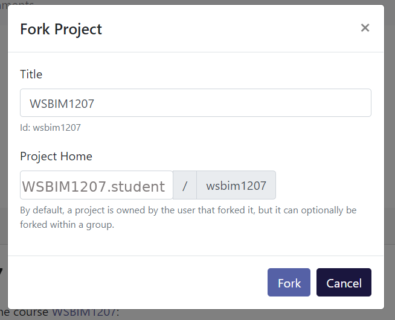

# Annex {#sec:anx}

## Local installation

This section describes how to install R, Rstudio, and a set of
important packages for the course.

1. Download R from the CRAN page:
   [https://cloud.r-project.org/](https://cloud.r-project.org/). At
   the top of that page, choose the *Download R* link corresponding to
   your operating system. 
   
   If you use Windows, follow *install R for the first time*, then
   click the link to download R. The installation procedure is like
   any other software, and you can safely use all default options.
   
   If you use Mac (OS X), download the *pkg* installer that matches
   you OS version and install like any other software
   
   Linux users are advised to use their package manager.
   
2. Download and install the Rstudio Desktop Open source edition:
   [https://rstudio.com/products/rstudio/download/#download](https://rstudio.com/products/rstudio/download/#download). Choose
   the installer for your operating system and version. Install as any
   other software.

3. Start Rstudio and install the following packages:

```{r, eval = FALSE}
install.packages(c("tidyverse", "rmarkdown", "remotes", "devtools"))
install.packages("BiocManager")
BiocManager::install("UCLouvain-CBIO/rWSBIM1207")
```

If during any of the package installation steps, you get asked to
update some packages, for example with a message like 

```
Old packages: 'tinytex', 'TSP', 'tximeta', 'umap', 'vctrs', 'waveslim',
  'xcms', 'xlsx', 'xml2'
Update all/some/none? [a/s/n]: 
```

You can answer `a` to update all your packages.

4. To be able to compile Rmd files into pdf, you will also need to
   install an additional software. On Windows, the easiest is to
   install `tinytex` direct from the R console with
   `tinytex::install_tinytex`[^tinytex].  For Max OSX, you will need
   to install
   [MacTeX](https://medium.com/@sorenlind/create-pdf-reports-using-r-r-markdown-latex-and-knitr-on-windows-10-952b0c48bfa9). [This
   post](https://medium.com/@sorenlind/create-pdf-reports-using-r-r-markdown-latex-and-knitr-on-macos-high-sierra-e7b5705c9fd)
   provides details. For linux, use your package manager to install
   the tex-live suite.

   Compilation to html will not require any additional installations
   and can also be used.

[^tinytex]: There might be messages or event errors during the
    installation of `tinytex`. At the end, you can run
    `tinytex:::is_tiny()` to verify if it installed successfully (if
    `TRUE` is returned).

## Using a cloud R/RStudio instance

An alternative to local installation is to use *virtual machines* that
run in the cloud. Here, we will use Renku platform provided by the
Swiss Data Science Center (SDSC).

1. Create a new renku user - click to *Login - Sign up* button on
   [https://renkulab.io/](https://renkulab.io/), click *Register* at
   the bottom of the login screen and follow instructions. 
   
   Once completed, you will get to the following (or similar) screen,
   belonging here to user `WSBIM1207.student`.
   
```{r, fig.cap = "Renky labding page.", echo = FALSE, message = FALSE}
knitr::include_graphics("./figs/renku_screen1.png")
```

2. Now that you have created a Renku account, you will need to fork
   (i.e. copy) the course renku project into your own account. To do
   so, open the following link:
   [https://renkulab.io/projects/laurent.gatto/wsbim1207/](https://renkulab.io/projects/laurent.gatto/wsbim1207/)
   

```{r, fig.cap = "The WSBIM1207 renku project page.", echo = FALSE, message = FALSE}
knitr::include_graphics("./figs/renku_screen2.png")
```
   The second support video below also demonstrates the following steps for another renku project.

3. Fork the project under your own account by click the `fork` button
   in the rop right corner (see previous screenshot). You can keep all
   the default values in the popup window and click on `Fork` again.

```{r, fig.cap = "Forking the WSBIM1207 renku project page.", echo = FALSE, message = FALSE}

```

4. The next window shows your personal copy of the `wsbim1207` Renku
   project.

```{r, fig.cap = "Forked WSBIM1207 renku project page.", echo = FALSE, message = FALSE}
knitr::include_graphics("./figs/renku_screen4.png")
```

5. Click the `Environments` tab and the `New` button to create a
   runnable cloud environment that contains R, RStudio, and all
   pre-installed packages. At this stage, if you already see an
   interactive environment (with a green tick box), you can
   immediately skip to step 8. Otherwise, the building could take up
   to 50 minutes (depending on caching). You can safely shut your
   computer down at this stage, as the environment is build in the
   cloud.


```{r, fig.cap = "The *Interactive Environment* tab.", echo = FALSE, message = FALSE}
knitr::include_graphics("./figs/renku_screen5.png")
```


```{r, fig.cap = "The Renku environment is being build.", echo = FALSE, message = FALSE}
knitr::include_graphics("./figs/renku_screen6.png")
```

6. Once build, you can start the cloud environment. Make sure you keep
   the default settings, i.e default environment `/rstudio` and `0.25`
   CPUs and `1G` of RAM. For this course, these low resources are
   enough[^res].
   
[^res]: Given that the resources are provided for free by the SDSC and
    are shared by all users, it is good practice to only use the
    resources that are needed.
   
```{r, fig.cap = "The environment build settings.", echo = FALSE, message = FALSE}
knitr::include_graphics("./figs/renku_screen7.png")
```

7. It will take some more time to get the environment started, shown
   below.
   
```{r, fig.cap = "The Renku environment is being build.", echo = FALSE, message = FALSE}
knitr::include_graphics("./figs/renku_screen8.png")
```

8. Once ready, you now only have to click the blue `Connect` button to
   start RStudio in the cloud.

```{r, fig.cap = "The Renku environment is now built.", echo = FALSE, message = FALSE}
knitr::include_graphics("./figs/renku_screen9.png")
```

```{r, fig.cap = "The Renku environment running RStudio.", fig.fullwidth = TRUE,  echo = FALSE, message = FALSE}
knitr::include_graphics("./figs/renku_screen10.png")
```

The RStudio instance has already all the required packages
pre-installed. To close the remote RStudio, either use `q()` in the R
console, click `File` and `Quit Session`, or the red round icon in the
top corner. Next time, it won't be necessary to repeat all the
steps. Simply navigate to your project's environment tab, rebuild the
environment in a matter of seconds and connect. The video below
illustrates these very same steps.

<iframe width="560" height="315" src="https://www.youtube.com/embed/veSrycUFcVs" frameborder="0" allow="accelerometer; autoplay; encrypted-media; gyroscope; picture-in-picture" allowfullscreen></iframe>

It is easey to upload files directly to the remote RStudio instance by
using the `Upload` button in RStudio's file navigator menu. To
download files or directories, select the files/folders in the file
menu and click on `More` and then `Export`. The video below briefly
illustrates this and demonstrates how to save any changes (including
new files and folders) back to Renku.

<iframe width="560" height="315" src="https://www.youtube.com/embed/0DQhX7Kwbgo" frameborder="0" allow="accelerometer; autoplay; encrypted-media; gyroscope; picture-in-picture" allowfullscreen></iframe>


Note that projects can only be forked once. If you want or need to
fork the WSBIM1207 Renku project again, you first need to delete your
existing fork:

1. Navigate to your project page.
2. In the top right corner, click on **View in GitLab**.
3. In the bottom left corner, click on **Settings**.
4. Click on **Advanced** at the bottom of the page.
5. Navigate to the very bottom and click on the red button **Remove
   project**.
6. You will be to type the name of the project (wsbim1207) en then
   confirm that you want to permanently delete it.
   
You can not restart the procedure described above.

### More about Renku {-}

Here are a set of introductory videos (in French) prepared by
[Christine Choirat](https://scholar.harvard.edu/cchoirat/home):

- [The Renku
  project](https://www.dropbox.com/s/gf0p3jjevt4e13s/V1_Renku_Intro_FR.mov?dl=0)
  (and
  [slides](https://docs.google.com/presentation/d/18tPAb1B3PKcOBhMnITm0BNQfPG8RbVWq4iCODehljjE/edit#slide=id.p1))
- [Getting started with a (forked) project](https://www.dropbox.com/s/fus0g6f3hzglpjy/V2_Launching_RStudio_FR.mov?dl=0)
- [Saving changes back to Renku](https://www.dropbox.com/s/l119urtzf21vm06/V3_Saving_Changes_to_Renku.mov?dl=0)


## Universal Desktop Service at UCLouvain.

Students at the UCLouvain can use the [Universal Desktop
Service](https://intranet.uclouvain.be/fr/myucl/services-informatiques/uds-universal-desktop-service.html)
(UDS) to access the software and files installed on the university
network through a virtual working environment.
